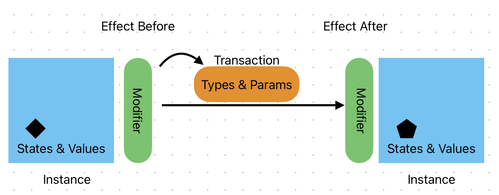
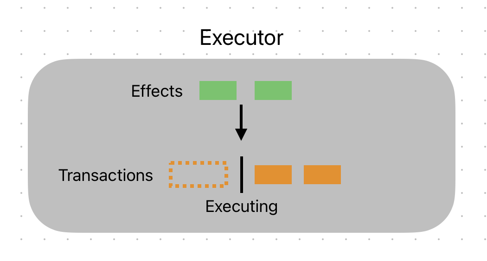

# 后端架构

## 卡牌效果与执行

卡牌效果模型相关代码在./model之中，demo在model_test之中。

### 什么是卡牌效果

**卡牌效果是让一个东西变化的行为**

对此设计了如下的基本架构，接下来一一解释。



### 什么是执行

为了保证任何变化都是决定性的，不应该存在同一种打法却出现不同的结果。为此，所有的transaction都应该被放入一个队列中有序执行。



如上图，所有的effects和transactions都会被提交给一个叫Executor的结构体中，它将负责让协调transaction的执行顺序以及effects的之间的互动。

### 名词解释

#### Instance

First things first, **instance is an interface!!!**

任何会变化的东西都是一个instance，包括:

- 一张场上的卡牌（生命值可能变化）
- 一张牌库的卡牌（可以被抽取到手牌中）
- 回合（你的回合/我的回合/第几回合/阶段）
- ...

每一个instance都有这他的states以及相关的values。各种states加在一起描述了这个instance当前的状态，比如“在手牌中”，“是伙伴牌”...states可以让其他代码读取出instance的相关属性，从而做出判断。value是对应states的，我们应该规定每一种states会对应相关的value，比如"是伙伴牌"state会保证values中存在“生命”与“攻击”。

**state保证了外界读取instance相关信息时有入口，不一定需要将所有值写在state value中**比如一个我们仅仅在state中标注“是伙伴牌”，外界同样可以通过这个信息，选择将该instance转换为相应的“伙伴”结构指针来获取如生命攻击等信息。

#### Transaction

**Transaction is also an interface!!!**

Transaction实现了instance变化的过程（也就是“干了什么事”），同样，它也有着types来记录该transaction的各种类型，比如“造成伤害”，“攻击”。这些标注可以用于外界与该transaction互动。对于每一种type，相应的param会记录必要的数值，来方便外界的操作。

Types & params和state & values关系类似，不用同一套名字是为了区分。

Transcation 会标注自己作用的instance (From/To)。

注意：一个transaction**不应该**将一个instance变成另一个instance，如果我们用id区分instance，一个transaction的from/to应该只有三中可能

- id_0 -> id_0
- nil -> id_0 (卡牌被生成)
- id_0 -> nil (卡牌移出游戏)
- ~~id_0 -> id_1（不应该出现）~~

（不同instance的转换是可以做到的，但是我觉得为了保持清晰，不应该有这种转换）

同时transaction 还将接受一个参数表modifiers，来接受一定的修正。比如如果一个伤害transaction发现了一个“伤害+1”的效果被卸载了modifiers里，那么它在执行时应当将自己的伤害+1。

**一个transaction可以引发另一个transaction。**

transaction以队列的形式一一执行，不会出现两个transaction同时执行的情况。

#### Effect

**Effect is also an interface!**

**Effect的作用是修正transaction。**

有两种effect，before 和 after，before用于在transaction执行前进行相应的修正（比如：所有伤害+1），after用于在transaction执行后进行相应的善后（比如：一个伙伴死亡后，本卡生命+1）。所有effects都是**全局**的，他们的触发条件由自己决定，他们通过读取transaction的types & values来决定是否以及如何触发自己的效果，通过给modifier写入参数或者引发新的transaction来实现自己的效果。

#### Executor

Executor内部维护一个transaction队列，负责一一执行其中的transaction。同时，它会将transaction提供给所有注册的effects来让effects自行判断。

在执行每一个transaction时，步骤是：遍历effectsBefore -> 执行transaction -> 遍历effectsAfter。

### 简单Demo

代码在./model/model_test.go

我们想如下的场景：

- 场上伙伴A有2点生命
- 场上具有效果：所有伤害+1（可能来自之前的某个伙伴B）
- 伙伴C具有1点生命和效果：在一个单位死亡后，本卡生命+1

现在你打出伙伴D，它的效果是：入场：造成1点伤害。你瞄准了伙伴A。

伙伴B的效果翻译一下就是：在一个type包含“伤害”的transaction执行前，写入modifier伤害+1

```go
func (e *EffectB) Modify(t Transaction, modifiers map[string]any) (map[string]any, error) {
	// this effects triggers before a transaction
	transactionTypes := t.GetTypes()
	for _, transactionType := range transactionTypes {
		if transactionType == "damage" {
			_, ok := modifiers["damageAddOn"]
			if ok {
				modifiers["damageAddOn"] = modifiers["damageAddOn"].(int) + 1
			} else {
				modifiers["damageAddOn"] = 1
			}
			break
		}
	}
	return modifiers, nil
}
```

伙伴C的效果翻译一下是：在一个“死亡”transaction被执行后，本卡执行一个生命+1 transaction。为什么要分两个transaction?因为一个transaction的from/to不可以是不同的instance

```go
func (e *EffectC) Modify(t Transaction, modifiers map[string]any) (map[string]any, error) {
	// this effect triggers after a transaction
	// if type contains die
	transactionTypes := t.GetTypes()
	for _, transactionType := range transactionTypes {
		if transactionType == "die" {
			// add life
			executor.AddTransaction(&AddLifeTransaction{})
		}
	}
	return modifiers, nil
}

```

我们需要相应的die transaction和add life transaction

```go
func (t *DieTransaction) Execute(modifiers map[string]any) error {
	// remove from game
	for i, instance := range game {
		if instance.GetId().id == t.Id.id {
			game = append(game[:i], game[i+1:]...)
		}
	}
	return nil
}
```

为了简化，以上die transaction直接将instance移除

```go
type AddLifeTransaction struct {
	target Id
}

func (t *AddLifeTransaction) Execute(modifiers map[string]any) error {
	for _, instance := range game {
		if instance.GetId().id == t.target.id {
			// convert it to card c
			cardC, ok := instance.(*CardC)
			if ok {
				cardC.Life++
			}
		}
	}
	return nil
}
```

AddLifeTransaction会将target的life 增加1 （这里简化，假设我们知道目标一定是CardC类型结构体）

我们将B，C的effect全部提交到负责执行的Executor里

```go
// a is now in game
game = append(game, NewCardA())
// register b's effect
executor.AddEffectBefore(&EffectB{})
// register c's effect
executor.AddEffectAfter(&EffectC{})
// add c into the game
game = append(game, NewCardC())
```

B卡的instance在这里并不需要，所有没有加入game列表

现在，来写D卡的入场效果，他会造成一点伤害，同时，他应该接受相应的modifier，来以此修改自己的伤害，如果自己成功杀死了一个伙伴，他应该引发相应的die transaction

```go
type DealDamageTransaction struct {
	FromId       Id
	ToId         Id
	DamageAmount int
}

func (t *DealDamageTransaction) Execute(modifiers map[string]any) error {
	// a simplified version
	// deal damage
	dmg := t.DamageAmount
	if _, ok := modifiers["damageAddOn"]; ok {
		dmg += modifiers["damageAddOn"].(int)
	}
	for _, instance := range game {
		if instance.GetId().id == t.ToId.id {
			companion, ok := instance.(Companion)
			if ok {
				if companion.GetLife() <= dmg {
					// die
					executor.AddTransaction(&DieTransaction{Id: t.ToId})
				}
			}
		}
	}
	return nil
}
```

现在，假设我们打出了D卡，并且要求executor结算所有的transaction:

```go
// d enters, add transaction
executor.AddTransaction(&DealDamageTransaction{
  FromId:       Id{6, true}, // card D
  ToId:         Id{0, true}, // card A
  DamageAmount: 1,
})

// execute all
executor.ExecuteAll()
```

接下来应该发生的事情是

1. Executor准备执行DealDamageTransaction
2. Executor遍历effectsBefore，B卡效果条件触发，写入modifier伤害+1
3. DealDamageTransaction开始执行，根据modifier将自己的伤害修改为2
4. 命中卡A，判断出A死亡，引出新的DieTransaction加入executor的队列
5. Executor遍历effectsAfter，没有更多与DealDamageTransaction互动的effect
6. Exector准备执行DieTransaction
7. Executor遍历effectsBefore，没有相关的
8. DieTransaction开始执行，将A移出游戏
9. Executor遍历effectsAfter，C卡效果引出AddLifeTransaction加入Executor队列
10. Executor准备执行AddLifeTransaction
11. Executor遍历effectsBefore，没有相关效果
12. AddLifeTransaction开始执行，将C卡生命+1变成2
13. Executor遍历effectsAfter，没有相关效果
14. Transaction队列为空，结算完成

游戏的结果应该是，现在场上只剩下伙伴C，并且具有2生命：

```go
assert.Equal(t, len(game), 1)
assert.Equal(t, game[0].GetId().id, 2)
assert.Equal(t, game[0].(*CardC).Life, 2)
```

run test可以验证